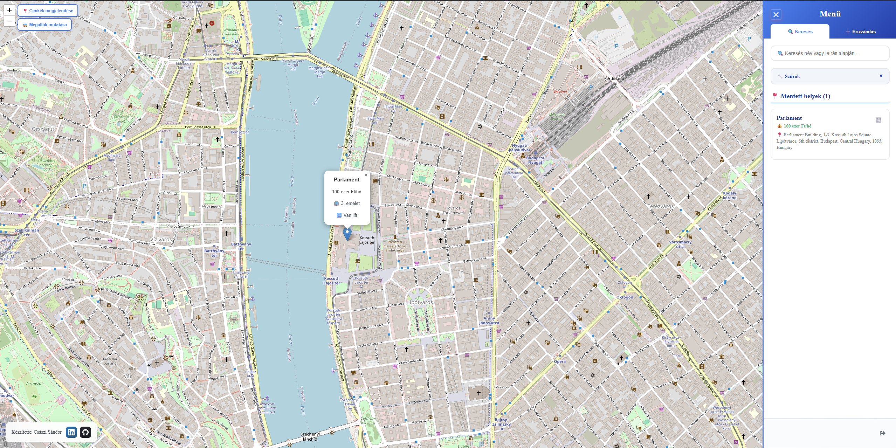
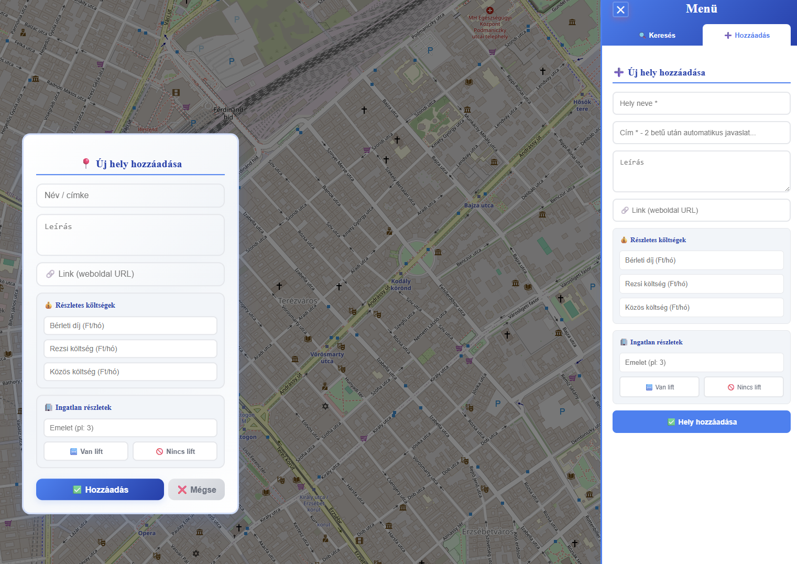
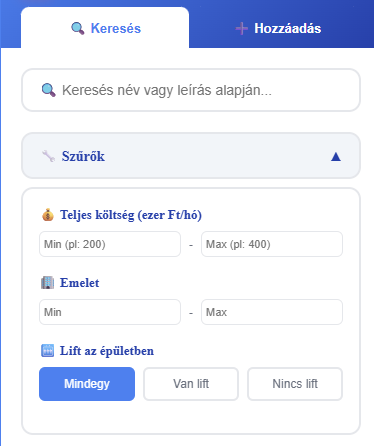
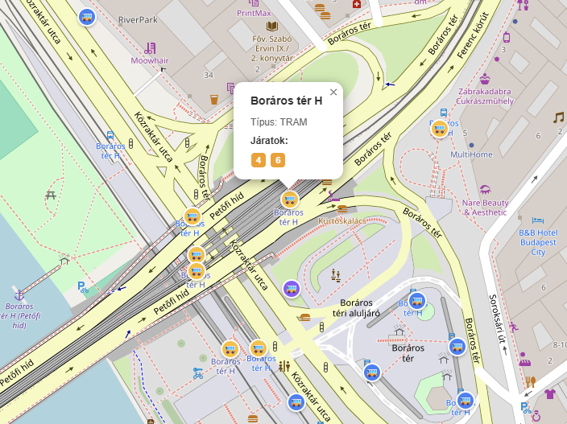
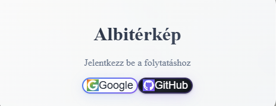
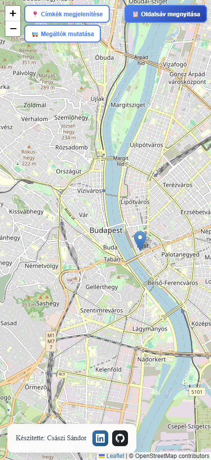

# 🏠 Rent Map - Interaktív Albérlet Kereső Térkép

🌐 **Élő alkalmazás**: [albiterkep.hu](https://albiterkep.hu) - Próbáld ki most!

👨‍💻 **Készítette**: [Császi Sándor](https://linkedin.com/in/sandorcsaszi) | [](https://github.com/sandorcsaszi) [](https://linkedin.com/in/sandorcsaszi)



## � Tartalomjegyzék
- [A Projekt Története](#-a-projekt-története)
- [Főbb Funkciók](#-főbb-funkciók)
- [Használati Útmutató](#-használati-útmutató)
- [Telepítés és Futtatás](#-telepítés-és-futtatás)
- [Környezeti Változók](#-környezeti-változók)
- [Technikai Részletek](#-technikai-részletek)
- [API Integráció](#-api-integráció)
- [Közreműködés](#-közreműködés)

## 💙 A Projekt Története

Az egész egy egyszerű problémával indult: albérletet kerestem Budapesten, és hamar rájöttem, mennyire fárasztó folyton különböző hirdetési oldalakat böngészni, majd minden egyes címet kézzel bepötyögni a Google Maps-be, hogy kiderítsem, pontosan hol is van.

Mivel programozó vagyok, úgy döntöttem, inkább készítek egy saját megoldást. Így született meg ez a modern webalkalmazás – egy adag frusztrációból, de annál több lelkesedéssel, hogy másoknak is könnyebb legyen az albérletkeresés.

## ✨ Főbb Funkciók

### 🗺️ Interaktív Térkép
- **Valós idejű navigáció**: Modern Leaflet térkép OpenStreetMap adatokkal
- **Kattintható hozzáadás**: Egyszerűen kattints a térképre új albérlet hozzáadásához
- **Dinamikus címkék**: Be- és kikapcsolható pin-ek címkékkel


### 📍 Intelligens Helyadatok
- **Automatikus geocoding**: Cím begépelése során automatikus helykiválasztás
- **Részletes információk**: Emelet, lift, bérleti díj, közös költség
- **Link tárolás**: Eredeti hirdetések URL-jének mentése



### 🔍 Fejlett Szűrési Rendszer
- **Ár alapú szűrés**: Min/max bérleti díj beállítása (ezer Ft-ban)
- **Emelet szűrés**: Specifikus emeletek kiválasztása
- **Lift szűrés**: Van/nincs lift opciók
- **Keresés**: Név vagy leírás alapú keresés



### 🚌 BKK Tömegközlekedés
- **Valós idejű megállók**: Budapest összes tömegközlekedési megállója
- **Automatikus betöltés**: Térkép mozgatásakor frissülő adatok
- **Cache rendszer**: Gyors és hatékony adatkezelés



### � Biztonságos Bejelentkezés
- **OAuth integráció**: Google és GitHub bejelentkezés
- **Felhasználói profilok**: Saját albérletek kezelése
- **Adatvédelem**: Minden adat privát, csak saját adatok láthatók



### 📱 Reszponzív Design
- **Mobil optimalizált**: Tökéletes élmény telefonon és tableten
- **Összehúzható oldalsáv**: Több hely a térképnek
- **Modern UI**: Tiszta, intuitív kék-fehér téma



## 📋 Használati Útmutató

### 1️⃣ Bejelentkezés
1. Nyisd meg az alkalmazást
2. Kattints a "Bejelentkezés" gombra
3. Válassz Google vagy GitHub bejelentkezést
4. Engedélyezd a hozzáférést

### 2️⃣ Új Albérlet Hozzáadása
1. **Térképen kattintás módszer**:
   - Kattints arra a helyre a térképen, ahol az albérlet van
   - Töltsd ki a megjelenő form-ot
   - Kattints a "Mentés" gombra

2. **Cím begépelés módszer**:
   - Kattints az "Oldalsáv" megnyitására
   - Válaszd a "Hozzáadás" fület
   - Kezdj el írni egy címet - automatikus javaslatok jelennek meg
   - Válassz a javaslatokból
   - Töltsd ki a részleteket

### 3️⃣ Albérletek Keresése és Szűrése
1. **Keresés név alapján**:
   - Az oldalsávban használd a keresőmezőt
   - Írj be kulcsszavakat a név vagy leírás alapján

2. **Szűrés feltételek szerint**:
   - Kattints a "Szűrők" gombra
   - Állítsd be az ár tartományt
   - Válassz ki maximum vagy minimum melyik szinten laknál
   - Szűrj, hogy van lift vagy nincs lift az épületben

### 5️⃣ BKK Megállók Megjelenítése
1. Kattints a "Megállók megjelenítése" gombra a térkép bal felső sarkában
2. A közelben lévő tömegközlekedési megállók megjelennek
3. Kattints egy megállóra a részletes információkért

## 🚀 Telepítés és Futtatás

### Előfeltételek
- **Node.js** (18.0 vagy újabb)
- **npm** vagy **yarn**
- **Git**

### 1. Projekt klónozása
```bash
git clone https://github.com/sandorcsaszi/rent-map.git
cd rent-map
```

### 2. Függőségek telepítése
```bash
npm install
```

### 3. Környezeti változók beállítása
```bash
# Másold le a példa fájlt
cp .env.example .env

# Windowson:
copy .env.example .env
```

### 4. Fejlesztői szerver indítása
```bash
npm run dev
```

Az alkalmazás elérhető lesz a `http://localhost:5173` címen.

### 5. Production build
```bash
npm run build
npm run preview
```

## 🔧 Környezeti Változók

A `.env` fájlban állítsd be a következő változókat:

```env
# BKK Futár API kulcs
VITE_BKK_API_KEY=your_bkk_api_key

# Supabase konfiguráció
VITE_SUPABASE_URL=https://your-project-ref.supabase.co
VITE_SUPABASE_ANON_KEY=your-anon-key

# Auth callback URLs
VITE_PRODUCTION_CALLBACK_URL=https://your-domain.com/auth/callback
```

### API kulcsok beszerzése

**BKK API kulcs** (opcionális):
1. Regisztrálj a [BKK Open Data](https://opendata.bkk.hu/) oldalon
2. Kérj API kulcsot a BKK Futár API-hoz
3. Az alkalmazás BKK kulcs nélkül is működik

**Supabase beállítás** (kötelező):
1. Hozz létre projektet a [Supabase](https://supabase.com/) oldalon
2. Kövesd a részletes útmutatót: [SUPABASE_SETUP.md](SUPABASE_SETUP.md)

## 🛠️ Technikai Részletek

### Frontend Stack
- **React 19** - Modern React hooks és Suspense
- **TypeScript** - Type-safe development
- **Vite** - Gyors fejlesztői környezet
- **Tailwind CSS** - Utility-first CSS framework
- **React Leaflet** - Térkép integráció

### Backend & Adatbázis
- **Supabase** - Backend-as-a-Service
- **PostgreSQL** - Relációs adatbázis
- **Row Level Security** - Adatbiztonság
- **Real-time subscriptions** - Élő adatfrissítés

### Külső API-k
- **OpenStreetMap** - Térkép adatok
- **Nominatim** - Geocoding szolgáltatás
- **BKK Futár API** - Tömegközlekedési adatok
- **Google OAuth** - Bejelentkezés
- **GitHub OAuth** - Bejelentkezés

### Architektúra
```
src/
├── components/          # Újrafelhasználható komponensek
├── containers/          # Fő alkalmazás konténerek
├── contexts/           # React Context (Auth, stb.)
├── services/           # API szolgáltatások
├── types/              # TypeScript típusdefiníciók
├── utils/              # Segédfunkciók
└── lib/                # Külső könyvtár konfigurációk
```

## 🌐 API Integráció

### Supabase API
- **Authentication**: OAuth bejelentkezés
- **Database**: Places táblázat CRUD műveletek
- **Real-time**: Automatikus adatszinkronizáció

### BKK Futár API
- **Stops**: Megállók lekérdezése koordináták alapján
- **Cache**: Intelligens cache-elés a teljesítményért
- **Error handling**: Graceful degradation API hiba esetén

## 🤝 Közreműködés

Örülök minden hozzájárulásnak! Ha szeretnél fejleszteni az alkalmazáson:

1. **Fork-old** a projektet
2. **Hozz létre** egy feature branch-et (`git checkout -b feature/amazing-feature`)
3. **Commit-old** a változtatásaidat (`git commit -m 'Add amazing feature'`)
4. **Push-old** a branch-re (`git push origin feature/amazing-feature`)
5. **Nyiss** egy Pull Request-et

### Fejlesztési Irányelvek
- TypeScript használata kötelező
- Komponensek tesztelése
- Responsive design betartása
- Accessibility szabályok követése

## 📄 Licenc

Ez a projekt MIT licenc alatt áll. Lásd a [LICENSE](LICENSE) fájlt a részletekért.

**API kulcsok beszerzése:**

**BKK API kulcs:**
1. Menj a https://opendata.bkk.hu/ oldalra
2. Regisztrálj egy fiókot
3. Kérj API kulcsot a BKK Futár API-hoz

**Supabase beállítás:**
1. Hozz létre egy projektet a https://supabase.com/ oldalon
2. Project Settings → API részben találod az URL-t és API kulcsot
3. Kövesd a részletes beállítási útmutatót: [SUPABASE_SETUP.md](SUPABASE_SETUP.md)

### 3. Fejlesztői szerver indítása
```bash
npm run dev
```

### 4. Production deploy (Vercel)
1. Frissítsd a `.env` fájlban a `VITE_PRODUCTION_CALLBACK_URL`-t a Vercel domain-eddel
2. Vercel Dashboard → Project Settings → Environment Variables-ben add meg a környezeti változókat
3. Supabase Dashboard → Authentication → URL Configuration-ben add hozzá a production callback URL-t

Aztán nyisd meg a böngészőt a `http://localhost:5173` címen, és már használhatod is! 🎉

## 🚌 BKK Megállók

Az alkalmazás képes megjeleníteni a budapesti tömegközlekedési megállókat a BKK Futár API segítségével. A funkció használatához API kulcs szükséges, de nélküle is tökéletesen működik az albérlet térkép.

**Funkciók:**
- ✅ Valós idejű megálló adatok
- ✅ Automatikus cache-elés a gyorsaság érdekében
- ✅ Térképnézet alapú szűrés
- ✅ Kattintható popup-ok részletes információkkal

## 🛠️ Technikai Részletek

- **React 19** + **TypeScript**
- **Leaflet** térképek
- **Vite**
- **Tailwind CSS**
- **OpenStreetMap**

## 💝 Köszönetnyilvánítás

Köszönöm mindenkinek, aki használja ezt az alkalmazást! Ha segített neked megtalálni az álmaid otthonát, vagy csak egyszerűen megkönnyítette az albérletkeresést, akkor már megérte elkészíteni. ❤️

---

**Inspiráció**: A végtelen scrollozás a hirdetési oldalakon 😅  
**Cél**: Hogy senki ne szenvedjen annyit az albérletkeresésben 🏡  
**Készítette**: [Császi Sándor](https://linkedin.com/in/sandorcsaszi) 👨‍💻  

[](https://github.com/sandorcsaszi)
[](https://linkedin.com/in/sandorcsaszi)