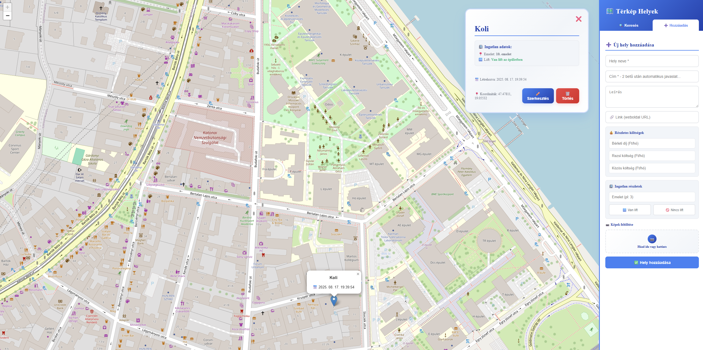

# 🏠 Rent Map - Albérlet Kereső Térkép

## 💙 A Történet Mögött
Az egész egy egyszerű problémával indult: albérletet kerestem Budapesten, és hamar rájöttem, mennyire fárasztó folyton különböző hirdetési oldalakat böngészni, majd minden egyes címet kézzel bepötyögni a Google Maps-be, hogy kiderítsem, pontosan hol is van. Egy idő után azt gondoltam: "Ennél biztosan lehetne egyszerűbben is!"

Mivel programozó vagyok, úgy döntöttem, inkább készítek egy saját megoldást. Így született meg ez a kis alkalmazás – egy adag frusztrációból, de annál több lelkesedéssel, hogy másoknak is könnyebb legyen az albérletkeresés.


*Az alkalmazás működés közben - térkép, szűrők minden egy helyen!*

## ✨ Mit Tud a webapp?

- 🗺️ **Interaktív térkép**: Minden albérletet egy helyen láthatsz, térképen megjelenítve
- 📍 **Egyszerű hozzáadás**: Kattints a térképre, add meg az adatokat, és máris látható a pin
- 🔍 **Okos keresés**: Címet írsz be, és automatikusan megtalálja a helyet
- 💰 **Árszűrés**: Szűrhetsz bérleti díj szerint (ezer forintokban)
- 🏢 **Részletes adatok**: Emelet, lift, közös költség - minden fontos infó egy helyen
- 🚌 **BKK megállók**: Budapesti tömegközlekedési megállók megjelenítése
- 💾 **Automatikus mentés**: Minden adat helyben marad, nem kell újra beírni
- 🎨 **Modern design**: Kellemes kék-fehér téma, hogy ne fájjon a szemed

## 🚀 Hogyan Indítsd El?

### 1. Függőségek telepítése
```bash
npm install
```

### 2. Környezeti változók beállítása
Másold le a `.env.example` fájlt `.env` néven:
```bash
cp .env.example .env
```

Vagy Windowson:
```bash
copy .env.example .env
```

Majd töltsd ki a `.env` fájlban a szükséges adatokat:

```env
# BKK Futár API kulcs (kötelező)
VITE_BKK_API_KEY=your_bkk_api_key

# Supabase konfiguráció (kötelező)
VITE_SUPABASE_URL=https://your-project-ref.supabase.co
VITE_SUPABASE_ANON_KEY=your-anon-key

# Auth callback URLs
VITE_LOCAL_CALLBACK_URL=http://localhost:5173/auth/callback
VITE_PRODUCTION_CALLBACK_URL=https://your-app-name.vercel.app/auth/callback
```

**API kulcsok beszerzése:**

**BKK API kulcs:**
1. Menj a https://opendata.bkk.hu/ oldalra
2. Regisztrálj egy fiókot
3. Kérj API kulcsot a BKK Futár API-hoz

**Supabase beállítás:**
1. Hozz létre egy projektet a https://supabase.com/ oldalon
2. Project Settings → API részben találod az URL-t és API kulcsot
3. Kövesd a részletes beállítási útmutatót: [SUPABASE_SETUP.md](SUPABASE_SETUP.md)

### 3. Fejlesztői szerver indítása
```bash
npm run dev
```

### 4. Production deploy (Vercel)
1. Frissítsd a `.env` fájlban a `VITE_PRODUCTION_CALLBACK_URL`-t a Vercel domain-eddel
2. Vercel Dashboard → Project Settings → Environment Variables-ben add meg a környezeti változókat
3. Supabase Dashboard → Authentication → URL Configuration-ben add hozzá a production callback URL-t

Aztán nyisd meg a böngészőt a `http://localhost:5173` címen, és már használhatod is! 🎉

## 🚌 BKK Megállók

Az alkalmazás képes megjeleníteni a budapesti tömegközlekedési megállókat a BKK Futár API segítségével. A funkció használatához API kulcs szükséges, de nélküle is tökéletesen működik az albérlet térkép.

**Funkciók:**
- ✅ Valós idejű megálló adatok
- ✅ Automatikus cache-elés a gyorsaság érdekében
- ✅ Térképnézet alapú szűrés
- ✅ Kattintható popup-ok részletes információkkal

## 🛠️ Technikai Részletek

- **React 19** + **TypeScript**
- **Leaflet** térképek
- **Vite**
- **Tailwind CSS**
- **OpenStreetMap**

## 💝 Köszönetnyilvánítás

Köszönöm mindenkinek, aki használja ezt az alkalmazást! Ha segített neked megtalálni az álmaid otthonát, vagy csak egyszerűen megkönnyítette az albérletkeresést, akkor már megérte elkészíteni. ❤️

---

**Inspiráció:** A végtelen scrollozás a hirdetési oldalakon 😅  
**Cél:** Hogy senki ne szenvedjen annyit az albérletkeresésben, mint én 🏡
**Készítette:** Császi Sándor 👨‍💻  
