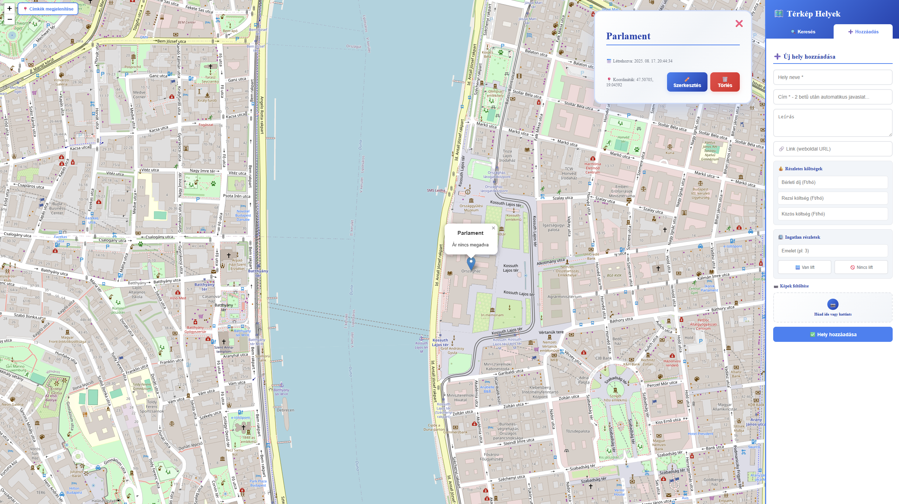

# 🏠 Rent Map - Albérlet Kereső Térkép

## 💙 A Történet Mögött
Az egész egy egyszerű problémával indult: albérletet kerestem Budapesten, és hamar rájöttem, mennyire fárasztó folyton különböző hirdetési oldalakat böngészni, majd minden egyes címet kézzel bepötyögni a Google Maps-be, hogy kiderítsem, pontosan hol is van. Egy idő után azt gondoltam: "Ennél biztosan lehetne egyszerűbben is!"

Mivel programozó vagyok, úgy döntöttem, inkább készítek egy saját megoldást. Így született meg ez a kis alkalmazás – egy adag frusztrációból, de annál több lelkesedéssel, hogy másoknak is könnyebb legyen az albérletkeresés.


*Az alkalmazás működés közben - térkép, szűrők minden egy helyen!*

## ✨ Mit Tud a webapp?

- 🗺️ **Interaktív térkép**: Minden albérletet egy helyen láthatsz, térképen megjelenítve
- 📍 **Egyszerű hozzáadás**: Kattints a térképre, add meg az adatokat, és máris látható a pin
- 🔍 **Okos keresés**: Címet írsz be, és automatikusan megtalálja a helyet
- 💰 **Árszűrés**: Szűrhetsz bérleti díj szerint (ezer forintokban)
- 🏢 **Részletes adatok**: Emelet, lift, közös költség - minden fontos infó egy helyen
- 💾 **Automatikus mentés**: Minden adat helyben marad, nem kell újra beírni
- 🎨 **Barátságos design**: Kellemes kék-fehér téma, hogy ne fájjon a szemed

## 🚀 Hogyan Indítsd El?

```bash
# Telepítsd a függőségeket
npm install

# Indítsd el a fejlesztői szervert
npm run dev
```

Aztán nyisd meg a böngészőt a `http://localhost:5173` címen, és már használhatod is! 🎉

## 🛠️ Technikai Részletek

- **React 19** + **TypeScript** - Modern, típusbiztos fejlesztés
- **Leaflet** térképek - Ingyenes és gyors
- **Vite** - Villámgyors fejlesztői környezet
- **Tailwind CSS** - Gyönyörű, reszponzív design
- **OpenStreetMap** - Pontos címkeresés

## 💝 Köszönetnyilvánítás

Köszönöm mindenkinek, aki használja ezt az alkalmazást! Ha segített neked megtalálni az álmaid otthonát, vagy csak egyszerűen megkönnyítette az albérletkeresést, akkor már megérte elkészíteni. ❤️

---

**Készítette:** Császi Sándor 👨‍💻  
**Inspiráció:** A végtelen scrollozás a hirdetési oldalakon 😅  
**Cél:** Hogy senki ne szenvedjen annyit az albérletkeresésben, mint én 🏡
